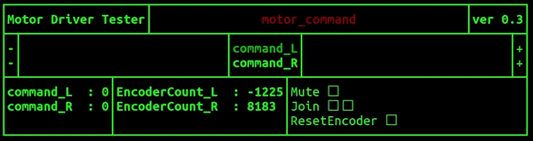

# pigeon_run

[Pigeon Motor Driver](https://github.com/PigeonSensei/pigeon_motor_driver) Tester Ros Package

### Dependency package

- [motor_driver_msgs](https://github.com/PigeonSensei/pigeon_motor_driver/tree/master/motor_driver_msgs)

### Run

```bash
rosrun pigeon_run motor_driver_tester_node
```

### Published Topics

- /motor_command (motor_driver_msgs/MotorCommand)

### Demo



### Input Key

select Item : W,S

Change value : A, S

at Reset value : X

all Reset value : Z

exit : ESC
